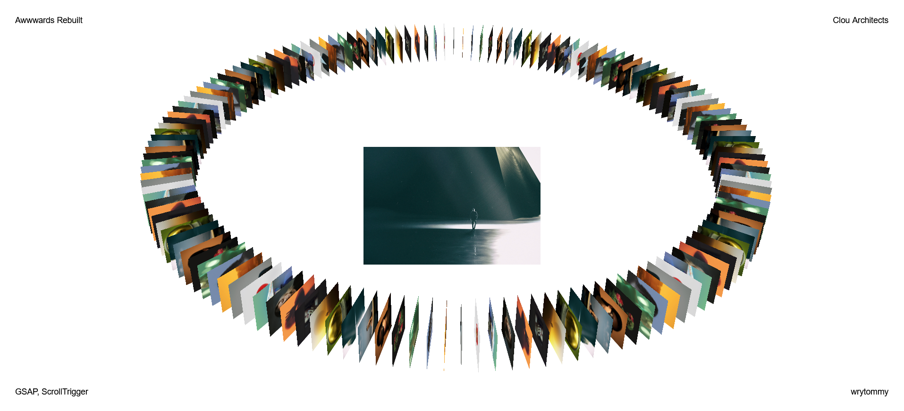

# Awwards Rebuilt 3D Gallery

This is a gallery application that allows users to browse through a collection of images in a 3D gallery environment. The application utilizes various libraries and functionalities to achieve this interactive experience.

## Functionality

- Users can rotate the gallery by dragging the mouse or swiping on touch devices.
- Hovering over individual images triggers a preview of the image in a larger view.
- Scroll wheel navigation enables users to switch between images in the gallery.
- Smooth animations enhance the user experience.
- The gallery is responsive and adapts to different screen sizes.

## Libraries Used

- [GSAP](https://greensock.com/gsap/)
- [ScrollTrigger](https://greensock.com/scrolltrigger/)

## Usage

To use the gallery application, simply open the `index.html` file in a web browser.

## Credits

This project draws inspiration from the website Clou Architects (www.clouarchitects.com), which was honored as an Awwwards Site of the Day. It serves as a homage to their innovative concept, aiming to emulate and learn from their design philosophy. This project is not an attempt to replicate or steal their ideas, but rather a sincere effort to understand and appreciate their creativity.

